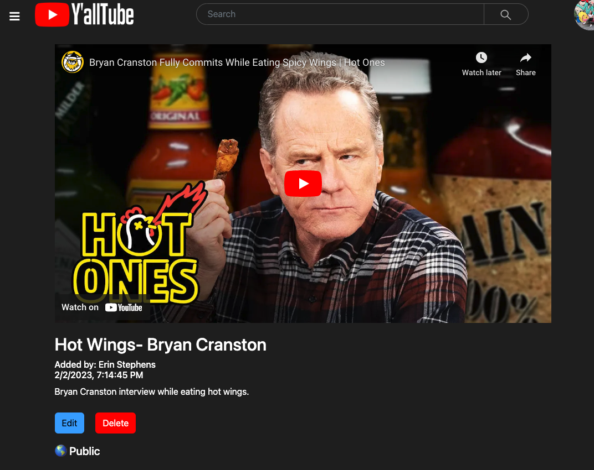

# Y'AllTube  [](https://app.netlify.com/sites/yalltube/deploys)

Welcome to Y'AllTube! Where you can see and add videos for all y'all using YouTube. 

[View Y'AllTube](https://yalltube.netlify.app/)

## About the User <!-- This is a scaled down user persona -->
- The ideal user for this application is anyone who likes to watch videos.
- The user wants to create a page of all their favorite videos from YouTube. 
- The problem this app solves for the user is that they can add videos from Youtube and see other's added videos in one place.
- Users 

## Features <!-- List your app features using bullets! Do NOT use a paragraph. No one will read that! -->
- When a new video is added an object should be created and that object should be pushed into an array of videos that then prints to the DOM.
- Public/ Private: Users can set the videos for public viewing or private viewing via and toggle button on the add video form.
- Users can see all public videos on the home page without being logged in. 
- Playlists: Users can create playlists for their favorite video topics. 


## Video Walkthrough of Y'allTube <!-- A loom link is sufficient -->
in process

## Relevant Links <!-- Link to all the things that are required outside of the ones that have their own section -->
- [Check out the deployed site](https://yalltube.netlify.app/)
- [Team Planning] (https://www.figma.com/file/77zzVyJ6pNG6uvh0FMyxea/Y'allTube-Brainstorm?node-id=44%3A20&t=K0mDhwL7G4qOp4kv-0)
- [Wireframes](https://excalidraw.com/#json=9GSOzwiCFtDO5MwDwgwb2,2OYNH24qcPerunzRlA_6Dg)
- [ERD](https://dbdiagram.io/d/63d571c6296d97641d7cbd78)

## Code Snippet <!-- OPTIONAL, but doesn't hurt -->
```
const handleSubmit = (e) => {
    e.preventDefault();
    if (obj.firebaseKey) {
      updateVideo(formInput)
        .then(() => router.push(`/video/${obj.firebaseKey}`));
    } else {
      const payload = {
        ...formInput, uid: user.uid, date_added: new Date().toLocaleString(), username: user.displayName,
      };
      createVideo(payload)
        .then(({ name }) => {
          const patchPayload = { firebaseKey: name };
          updateVideo(patchPayload)
            .then(() => {
              router.push('/library');
            });
        });
    }
  };
  ```

## Project Screenshots <!-- These can be inside of your project. Look at the repos from class and see how the images are included in the readme -->
    

## Contributors
- [Erin Stephens](https://github.com/erin-stephens)
- [Allison Blumenthal](https://github.com/allison-blumenthal)
- [Whitley Beers](https://github.com/WhitleyBeers)
- [Eric Frey](https://github.com/ericlfrey)
- [Graham Reid](https://github.com/GrahamJReid)
